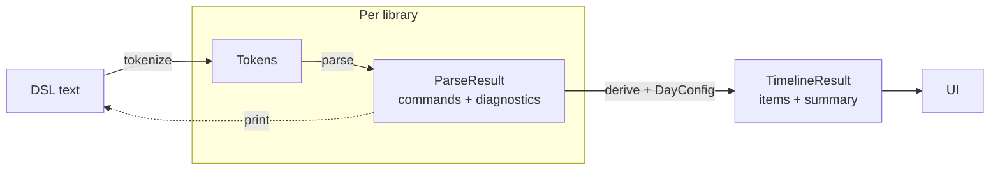

# Rule parser

A proof of concept for the SoA rule DSL: a small text language that describes when activities happen on a study day. The UI from the PRD ([FSD: Replace Intraday with SoA Rules](https://farohealth.atlassian.net/wiki/spaces/PROD/pages/4323541016/PRD+FSD+Replace+Intraday+with+SoA+Rules)) builds this text from forms, a parser turns it back into commands, and a derivation step lays the commands out as a timeline.

The main goal is to pick a lexer/parser library. Every candidate implements the same interface and runs against the same fixtures, so the libraries can be compared fairly.

```
"PK sampling":
  3x rel "IP Administration" pre, post 1h 2h
"Vital Signs":
  3x before "PK sampling"
"12-lead ECG":
  after "Vital Signs"
```

## Pipeline



Only `tokenize` and `parse` depend on the library. The printer, the derivation and the UI are written once and read the shared `ParseResult`.

The text has two modes, picked by the first token:

- **Rules mode:** activity headers (`"Name":`) or anchor headers (`anchor "Name":`), each followed by rules such as count, dependency, fasting-wait, spacing, composite, travel and hospitalization.
- **Sequence mode:** text that starts with `sequence` is a literal day, one slot per line (`"Vital Signs" 15m`, `wait 40m`).

## Layout

| Path | What it is |
| --- | --- |
| [`lexemes.md`](lexemes.md) | Source of truth for the vocabulary: tokens, rules, examples and semantics decisions |
| `lexemes.json` | Generated from `lexemes.md`. Do not edit by hand |
| [`contract.md`](contract.md) | Types the parser hands to the UI: `Token`, `Diagnostic`, `Command`, `Item` and which UI component reads what |
| [`task.md`](task.md) | The library comparison task, how to add a library, and the evaluation criteria |
| [`comparison.md`](comparison.md) | Results, one column per library |
| `fixtures/` | Input texts with their expected parse output (`*.parse.json`), day config and timeline items (`*.items.json`) |
| `ui/` | React + Vite app: parser picker, editable input, diagnostics and the items table |
| `ui/src/parsers/` | One folder per library behind the `RuleParser` interface, plus the shared conformance test and benchmarks |
| `ui/src/derivation/` | Library-independent `derive()` that turns commands into timeline items |

## Getting started

```bash
cd ui
npm install
npm run dev            # open the UI and pick a parser
npm test               # derivation and parser tests
npm run test:parsers   # conformance test for every registered library
npm run bench          # tokenize and parse timings per library
npm run typecheck
```

After editing `lexemes.md`, regenerate the JSON files:

```bash
node generate-lexemes.mjs     # lexemes.json
node generate-scenarios.mjs   # fixtures/scenarios.json, needs lexemes.json first
```

## Adding a library

Copy `ui/src/parsers/_template/` to `ui/src/parsers/<library>/`, implement `tokenize` and `parse`, and register it in `ui/src/parsers/registry.ts`. Then add a column to `comparison.md`. [`task.md`](task.md) has the full steps and the criteria.

## Status

| Library | Conformance |
| --- | --- |
